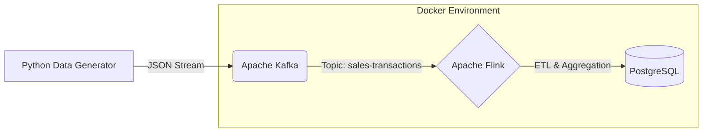

# Real-Time E-commerce Transaction Pipeline

Este projeto implementa um pipeline de Engenharia de Dados em tempo real, simulando um ambiente de e-commerce robusto. O sistema captura transações de vendas geradas dinamicamente, processa-os em stream e armazena os resultados consolidados para análise.

## 🏗️ Arquitetura

O fluxo de dados segue a arquitetura **Event-Driven**:



### Tecnologias Utilizadas
*   **Apache Kafka**: Ingestão de mensagens e desacoplamento de sistemas.
*   **Apache Flink (Java)**: Processamento de stream de baixa latência, transformação de dados e agregação temporal.
*   **PostgreSQL**: Camada de persistência (Sink) para dados processados.
*   **Docker & Docker Compose**: Orquestração de todo o ambiente (Zookeeper, JobManager, TaskManager, Broker, DB).
*   **Python (Faker)**: Simulação de carga de dados realista (Transações de vendas).

## 🚀 Funcionalidades

1.  **Ingestão de Dados em Tempo Real**: Script Python gera transações de vendas com dados aleatórios (produtos, preços, categorias) e envia para o Kafka.
2.  **Processamento Stream (Flink)**:
    *   Consumo do tópico kafka `sales-transactions`.
    *   Parseamento de JSON.
    *   Sink 1: Persistência bruta das transações no Postgres.
    *   **Agregação**: Cálculo de total de vendas por categoria em tempo real (Keyed Stream).
    *   Sink 2: Atualização contínua (Upsert) da tabela de métricas `sales_per_category`.

## 🛠️ Como Executar

### Pré-requisitos
*   Docker & Docker Compose
*   Java/Maven (para compilação) ou Docker
*   Python 3

### Passo a Passo

1.  **Subir o Ambiente**:
    ```bash
    cd docker
    docker-compose up -d
    ```

2.  **Gerar Dados (Producer)**:
    ```bash
    cd python
    pip install -r requirements.txt
    python main.py
    ```

3.  **Compilar e Submeter o Job Flink**:
    *   Compile o projeto Java (`mvn clean package`).
    *   Submeta o JAR gerado no painel do Flink (`http://localhost:8081`).

4.  **Verificar Resultados**:
    Acesse o PostgreSQL e consulte as tabelas:
    ```sql
    SELECT * FROM sales_per_category;
    ```

---
*Projeto desenvolvido como parte do Bootcamp de Engenharia de Dados (XP Educação).*
