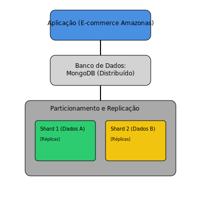
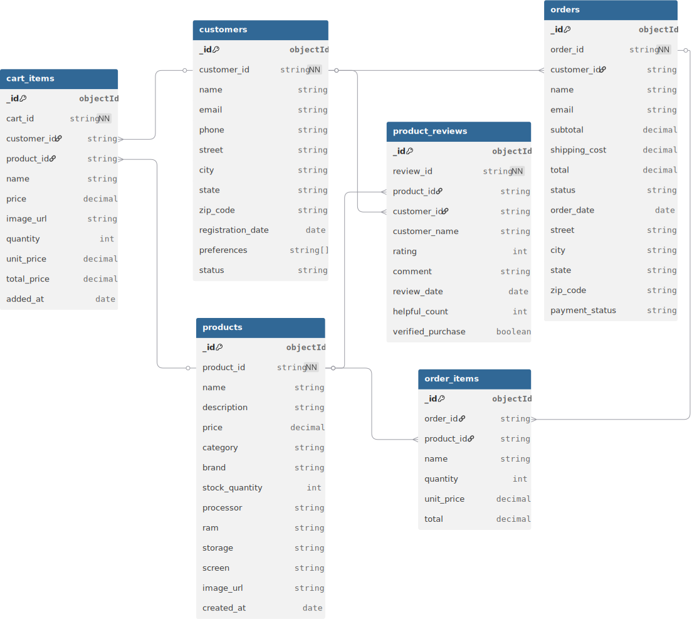
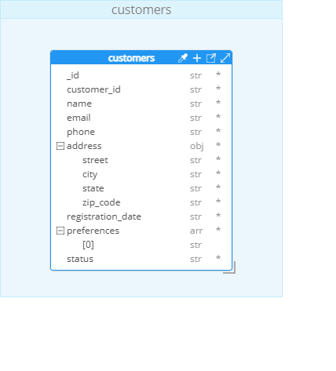
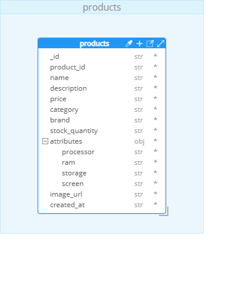
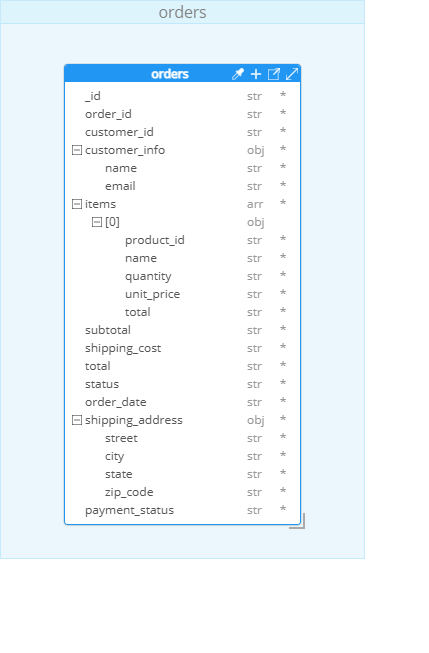
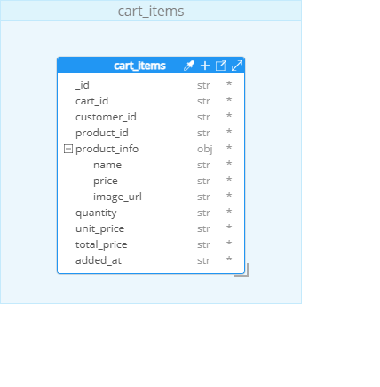
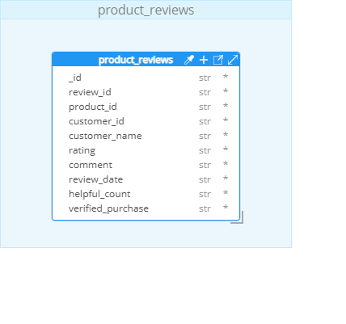

# Documento Arquitetural de Dados
## Sistema E-commerce Amazonas

**Bootcamp:** Arquiteto de Dados  
**Módulo:** Desafio Final  
**Projeto:** E-commerce Amazonas  
**Autor:** Cássio Esteves
**Data:** Outubro 2025

---

## 1. Introdução e Objetivos

### 1.1 Contexto do Projeto

A loja "Amazonas" busca expandir sua atuação para o mercado digital, oferecendo uma vasta gama de produtos (eletrônicos, vestuário, utensílios domésticos e livros) através de uma plataforma de e-commerce robusta. O objetivo é se tornar a maior loja de comércio eletrônico do Brasil, capaz de atender milhões de clientes com alta performance e disponibilidade.

### 1.2 Objetivos Principais

- Criar uma estrutura de dados não-relacional escalável e flexível.
- Projetar uma arquitetura que garanta alta performance e disponibilidade.
- Planejar o suporte ao crescimento rápido e exponencial de clientes e transações.
- Definir estratégias de escalabilidade horizontal (sharding) e replicação.

### 1.3 Tecnologias Propostas

- **Banco de Dados:** MongoDB
- **Modelagem:** Hackolade

---

## 2. Arquitetura Proposta

### 2.1 Visão Geral da Arquitetura

Para atender aos requisitos de escalabilidade e alta disponibilidade, propõe-se uma arquitetura de banco de dados distribuído. A ideia central é não depender de um único servidor, mas sim de um conjunto de servidores que trabalham em equipe. Esta abordagem se baseia em dois conceitos fundamentais:

- **Particionamento (Sharding):** Os dados são divididos horizontalmente em múltiplos servidores ou conjuntos de servidores (chamados de "Shards"). Cada shard contém apenas uma parte do total de dados, permitindo que o sistema cresça simplesmente adicionando novos shards.

- **Replicação (Replication):** Para garantir a alta disponibilidade e proteger contra falhas, os dados de cada shard são replicados (copiados) em múltiplos servidores. Se um servidor falhar, uma de suas réplicas assume automaticamente, evitando a perda de dados e a indisponibilidade do sistema.

### 2.2 Diagrama da Arquitetura Conceitual

O diagrama abaixo representa, de forma simplificada, a interação entre a aplicação e a arquitetura de banco de dados distribuído proposta.



### 2.3 Estratégia de Replicação Proposta

Para garantir alta disponibilidade, a arquitetura propõe que cada shard seja, na verdade, um conjunto de servidores com réplicas dos mesmos dados. Neste conjunto, um servidor atua como **primário** (aceitando escritas) e os outros como **secundários** (cópias prontas para assumir em caso de falha e para distribuir a carga de leitura).

### 2.4 Estratégia de Sharding Proposta

O particionamento dos dados (sharding) é crucial para a escalabilidade. A estratégia proposta é dividir as coleções principais em shards diferentes, com base em uma "chave de shard" que faz sentido para o negócio:

- A coleção `products` seria particionada pela chave `category`.
- A coleção `orders` seria particionada pela chave `order_date`.
- As demais coleções (`customers`, `cart_items`, `product_reviews`) seriam distribuídas com base em suas chaves (`customer_id` ou `product_id`).

---

## 3. Modelagem de Dados

### 3.1 Diagrama do Modelo Lógico

Este diagrama representa o modelo relacional do banco de dados AMAZONAS_DB, utilizado para um sistema de e-commerce. Ele inclui as tabelas principais:  `customers `,  `products `,  `orders `,  `order_items `,  `cart_items ` e  `product_reviews ` e os relacionamentos entre elas, mostrando como os clientes interagem com produtos, realizam pedidos, adicionam itens ao carrinho e escrevem avaliações. O diagrama foi criado no dbdiagram.io.



### 3.2 Visão Geral das Coleções

Foram projetadas **5 coleções principais** para o sistema:

1. **customers** - Informações dos clientes
2. **products** - Catálogo de produtos
3. **orders** - Pedidos realizados (desnormalizada)
4. **cart_items** - Itens no carrinho de compras
5. **product_reviews** - Avaliações de produtos

### 3.3 Modelo Lógico e Detalhamento das Coleções

#### 3.2.1 Coleção: customers



**Estrutura:**
```json
{
  "_id": ObjectId,
  "customer_id": "CUST101",
  "name": "Ana Pereira",
  "email": "ana.pereira@example.com",
  "phone": "+55 31 91234-5678",
  "address": {
    "street": "Rua da Bahia, 1000",
    "city": "Belo Horizonte",
    "state": "MG",
    "zip_code": "30160-011"
  },
  "registration_date": ISODate("2024-02-10"),
  "preferences": ["home", "books"],
  "status": "active"
}
```

**Justificativa:**
- Dados de cliente em único documento para performance de leitura.
- Endereço embutido (embedded) para evitar joins.

**Shard Key:** `customer_id`

#### 3.2.2 Coleção: products



**Estrutura:**
```json
{
  "_id": ObjectId,
  "product_id": "PROD101",
  "name": "Monitor Gamer LG UltraGear 27\"",
  "description": "Monitor Full HD, 144Hz, 1ms, IPS com HDR10",
  "price": 1899.90,
  "category": "Electronics",
  "brand": "LG",
  "stock_quantity": 15,
  "attributes": {
    "size": "27 polegadas",
    "resolution": "1920x1080",
    "refresh_rate": "144Hz",
    "panel_type": "IPS"
  },
  "image_url": "https://example.com/images/prod101.jpg",
  "created_at": ISODate("2024-01-20")
}
```

**Justificativa:**
- Atributos variáveis em um subdocumento para flexibilidade.
- Chave de shard por `category` para distribuir produtos por tipo.

**Shard Key:** `category`

#### 3.2.3 Coleção: orders



**Estrutura:**
```json
{
  "_id": ObjectId,
  "order_id": "ORD101",
  "customer_id": "CUST101",
  "customer_info": {
    "name": "Ana Pereira",
    "email": "ana.pereira@example.com"
  },
  "items": [
    {
      "product_id": "PROD101",
      "name": "Monitor Gamer LG UltraGear 27\"",
      "quantity": 1,
      "unit_price": 1899.90,
      "total": 1899.90
    }
  ],
  "subtotal": 1899.90,
  "shipping_cost": 75.50,
  "total": 1975.40,
  "status": "shipped",
  "order_date": ISODate("2024-04-10"),
  "shipping_address": {
    "street": "Rua da Bahia, 1000",
    "city": "Belo Horizonte",
    "state": "MG",
    "zip_code": "30160-011"
  },
  "payment_status": "paid"
}
```

**Justificativa:**
- Alta desnormalização para evitar joins e otimizar a leitura de pedidos completos.
- Dados de cliente, produtos e endereço são copiados para preservar o histórico do momento da compra.

**Shard Key:** `order_date`

#### 3.2.4 Coleção: cart_items



**Estrutura:**
```json
{
  "_id": ObjectId,
  "cart_id": "CART101",
  "customer_id": "CUST103",
  "product_id": "PROD103",
  "product_info": {
    "name": "Livro: O Hobbit",
    "price": 49.90,
    "image_url": "https://example.com/images/prod103.jpg"
  },
  "quantity": 1,
  "unit_price": 49.90,
  "total_price": 49.90,
  "added_at": ISODate("2024-04-20")
}
```

**Justificativa:**
- Desnormalização parcial com informações do produto para exibição rápida do carrinho.

**Shard Key:** `customer_id`

#### 3.3.5 Coleção: product_reviews



**Estrutura:**
```json
{
  "_id": ObjectId,
  "review_id": "REV101",
  "product_id": "PROD101",
  "customer_id": "CUST101",
  "customer_name": "Ana Pereira",
  "rating": 5,
  "comment": "Imagem incrível, os 144Hz fazem muita diferença nos jogos!",
  "review_date": ISODate("2024-04-18"),
  "helpful_count": 25,
  "verified_purchase": true
}
```

**Justificativa:**
- Nome do cliente embutido para evitar join ao exibir a avaliação.

**Shard Key:** `product_id`

---

## 4. Escalabilidade

### 4.1 Crescimento de Dados

**Estratégias Propostas:**

1. **Sharding Horizontal:** Particionar as coleções em múltiplos servidores para distribuir a carga de dados e de escrita/leitura.
2. **Particionamento Temporal:** Arquivar dados antigos (ex: pedidos com mais de 2 anos) em um armazenamento mais barato (cold storage) para manter as coleções principais mais enxutas e performáticas.
3. **Indexação Estratégica:** Criar índices em campos frequentemente usados em consultas para acelerar as buscas.

### 4.2 Alta Concorrência

**Estratégias Propostas:**

1. **Read Preference:** Direcionar operações de leitura para os nós secundários dos Replica Sets, aliviando a carga do nó primário.
2. **Write Concern:** Ajustar a garantia de escrita para balancear entre performance e consistência, dependendo da criticidade da operação.
3. **Caching:** Implementar uma camada de cache (ex: com Redis) para armazenar dados acessados frequentemente, diminuindo a carga no banco de dados.

### 4.3 Alta Disponibilidade

**Replicação:** A utilização de Replica Sets para cada shard garante que, em caso de falha do nó primário, um secundário seja promovido automaticamente, evitando downtime.

---

## 5. Vantagens da Arquitetura Proposta

- **Escalabilidade Horizontal:** Capacidade de crescer adicionando mais servidores (shards) sem grandes alterações na aplicação.
- **Performance:** Consultas otimizadas pela desnormalização e distribuição de carga.
- **Flexibilidade:** O esquema não-relacional permite fácil evolução da estrutura de dados.
- **Alta Disponibilidade:** A replicação de dados minimiza o risco de perda de dados e indisponibilidade do sistema.

---

## 6. Implementação na Nuvem (Visão Teórica)

### 6.1 MongoDB Atlas

O MongoDB Atlas é a plataforma de nuvem oficial do MongoDB e seria a escolha natural para hospedar esta arquitetura. Ele oferece gerenciamento automático de clusters, sharding, replicação, backups e monitoramento, simplificando a operação.

### 6.2 DynamoDB (Alternativa)

Como alternativa, o DynamoDB da AWS poderia ser usado. Seria necessário adaptar o modelo de dados para o formato chave-valor do DynamoDB, mas ele oferece vantagens como escalabilidade totalmente gerenciada e baixa latência.

---

## Apêndice A: Scripts para Importação no Hackolade

Para facilitar a criação do diagrama de modelo de dados, foram gerados scripts JSON para cada coleção. Estes arquivos podem ser importados no Hackolade através da função "Reverse Engineer".

Os arquivos estão localizados na pasta `../modelagem-hackolade/` e são:

- `customers.json`
- `products.json`
- `orders.json`
- `cart_items.json`
- `product_reviews.json`

---

**Autor**

Cássio Esteves

📧 Email: cassio.esteves@hotmail.com  
💼 LinkedIn: https://www.linkedin.com/in/cassioesteves/  
🐙 GitHub: https://github.com/cassioesteves
