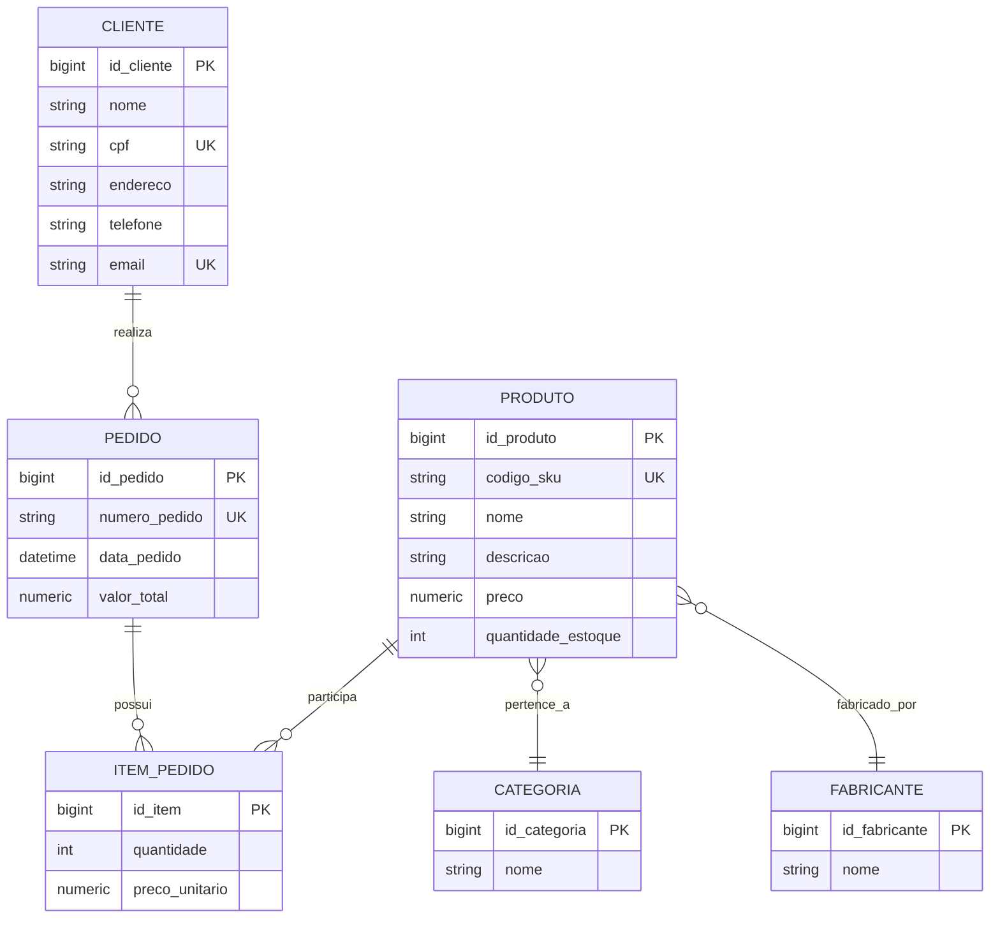
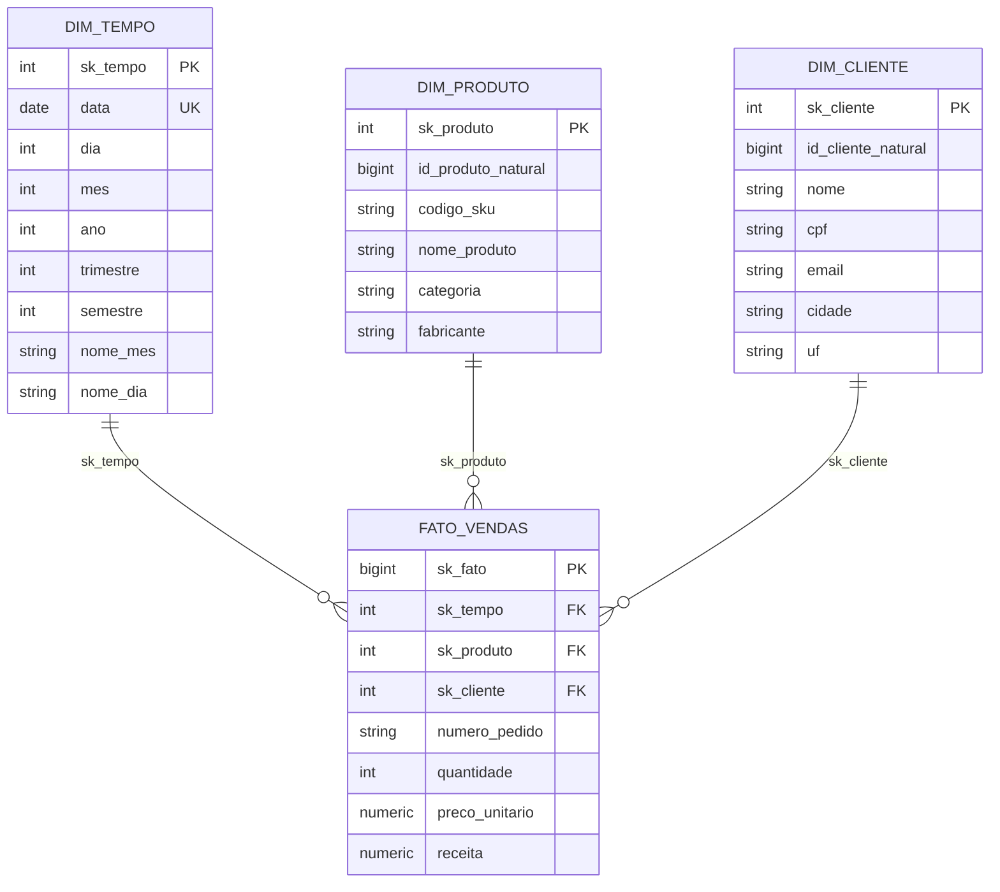

# TechStore — Modelagem de Dados (Conceitual, Lógica, Física e Dimensional)

Escopo
- Cadastro de Clientes; Produtos; Vendas (Pedidos e Itens); Relatórios: vendas por período, produtos mais vendidos, categorias com maior faturamento.

1) Modelo Conceitual (ER)

2) Modelo Lógico (Relacional)
- clientes(id_cliente PK, nome, cpf UK, endereco, telefone, email UK)
- fabricantes(id_fabricante PK, nome)
- categorias(id_categoria PK, nome UK)
- produtos(id_produto PK, codigo_sku UK, nome, descricao, id_categoria FK, id_fabricante FK, preco, quantidade_estoque)
- pedidos(id_pedido PK, numero_pedido UK, data_pedido, id_cliente FK, valor_total)
- itens_pedido(id_item PK, id_pedido FK, id_produto FK, quantidade, preco_unitario, UK(id_pedido, id_produto))

Observações
- 3FN: atributos atômicos e dependências apenas da chave; cadastros de domínio (categoria, fabricante) em tabelas próprias; e-mails/CPFs/códigos com unicidade.
- valor_total pode ser mantido por consistência de relatório; alternativamente, calcular via soma dos itens.

3) Modelo Dimensional (Star Schema)
Grão do fato: 1 linha por item de pedido (produto em um pedido, na data X).

Consultas de negócio suportadas
- Vendas por período: somatório de receita por dia/mês/ano (Dim Tempo).
- Produtos mais vendidos: top N por quantidade/receita (Dim Produto).
- Categorias com maior faturamento: agregação por categoria (atributo da Dim Produto).

Anotações de Chaves
- OLTP: chaves substitutas (BIGINT identidade) e chaves naturais únicas (cpf, email, codigo_sku, numero_pedido).
- DW: chaves substitutas nas dimensões (sk_*) e, opcionalmente, chaves naturais carregadas para rastreabilidade.

Nota rápida (Pergunta 2)
- Atributo adequado na Tabela Fato "Vendas": Quantidade vendida (medida).
- Atributos descritivos ficam nas Dimensões:
  - Dim Produto: categoria, nome do produto, fabricante.
  - Dim Cliente: nome do cliente, cpf, email.

Nota rápida (Pergunta 3)
- Escolha pelo modelo Estrela: dimensões desnormalizadas (ex.: Dim Produto já contém categoria e fabricante).
- O que indicaria modelo Floco de Neve: dimensões normalizadas, distribuindo atributos em tabelas hierárquicas (ex.: Dim Produto referenciando Dim Categoria e Dim Fabricante por FK).

Nota rápida (Pergunta 4)
- Integridade Clientes x Pedidos: FK em Pedidos (id_cliente) referenciando Clientes(id_cliente).

Nota rápida (Pergunta 5)
- Finalidade de uma entidade associativa: representar um relacionamento que possui atributos próprios.
- No ER, ITEM_PEDIDO é a entidade associativa do relacionamento PEDIDO x PRODUTO, armazenando quantidade e preco_unitario.

Nota rápida (Pergunta 6)
- O que caracteriza uma Tabela Fato: conter métricas/medidas numéricas de um processo (ex.: quantidade, preço unitário, receita) e chaves para dimensões.

Nota rápida (Pergunta 7)
- NÃO é característica do modelo Estrela: "Maior número de tabelas comparado ao modelo Floco de Neve".
- Estrela: dimensões desnormalizadas, menos tabelas e menos junções (consultas mais simples).
- Floco de Neve: dimensões normalizadas em hierarquias, mais tabelas e mais junções.

Nota rápida (Pergunta 8)
- Estrutura correta de Itens do Pedido: chave única composta (id_pedido, id_produto) e FKs para Pedidos e Produtos.
- Motivo: impede duplicidade do mesmo produto no mesmo pedido e mantém a integridade referencial.

Nota rápida (Pergunta 9)
- Melhor opção entre as alternativas: o código do produto criado exclusivamente para identificá-lo (chave natural).
- No modelo lógico adotado: usamos PK substituta (id_produto) e mantemos o código do produto (codigo_sku) como chave natural UNIQUE para evitar duplicidades e facilitar integrações.

Nota rápida (Pergunta 10)
- Estrutura recomendada para Estoque: FK única para Produtos (id_produto UNIQUE) + campo quantidade (>= 0).
- Benefício: assegura 1 registro de estoque por produto (unicidade) e integridade referencial via FK.
- Observação: se adotar a tabela de Estoques, remova o campo quantidade_estoque de Produtos para evitar redundância.

Nota rápida (Pergunta 11)
- Correta entre as alternativas: “Uma chave estrangeira deve obrigatoriamente referenciar a chave primária de outra tabela.”
- Observação técnica: uma FK pode referenciar qualquer chave candidata (PK ou conjunto de colunas com UNIQUE).
- Lembretes: cada tabela possui uma única PK (pode ser composta) e suas colunas não aceitam valores NULL.

Nota rápida (Pergunta 12)
- Característica exclusiva do Floco de Neve: dimensões podem estar normalizadas, reduzindo redundâncias.
- Trade-off: mais tabelas e mais junções nas consultas, ao contrário do Estrela (dimensões desnormalizadas e menos junções).

Nota rápida (Pergunta 13)
- Uso de hierarquias em dimensões: organizar atributos em níveis que suportam análises em diferentes granularidades (drill-down/roll-up).
- Exemplo: Dim Tempo — Ano > Semestre > Trimestre > Mês > Dia permite comparar por ano e detalhar até o dia.

Nota rápida (Pergunta 14)
- Relacionamento M:N na modelagem lógica: criar uma tabela intermediária (associativa) contendo as chaves das duas entidades.
- Pode ter PK própria (surrogate) e uma UNIQUE composta para evitar duplicidade.
- Exemplo: Itens do Pedido resolve M:N entre Pedidos e Produtos (FKs para ambas; UK(id_pedido, id_produto)).

Nota rápida (Pergunta 15)
- Cardinalidade 1:N no modelo lógico: a tabela do lado “muitos” contém a FK referenciando a PK do lado “um”.
- Exemplos: Pedidos.id_cliente -> Clientes.id_cliente; Produtos.id_categoria -> Categorias.id_categoria; Produtos.id_fabricante -> Fabricantes.id_fabricante.
